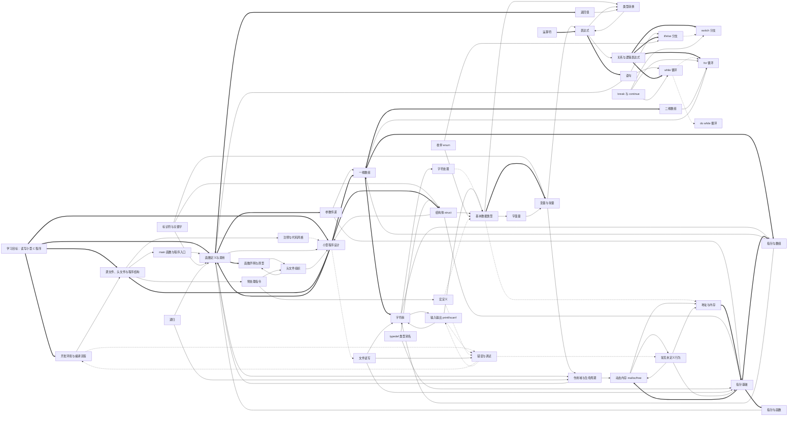

# C 语言基础语法学习知识图谱

> 这是学习网站的总图谱文件，负责展示 C 语言基础语法知识点之间的网状关系。每个节点的详细教学文档已经拆分到 `知识点/` 目录中。

## 1. 图谱说明

### 1.1 边的含义

- `-->`：前置依赖。学习后者通常需要先理解前者。
- `-.->`：关联关系。两个知识点经常一起出现，但不一定严格先后。
- `==>`：强关联或核心路径。学习目标中非常关键的能力迁移。

### 1.2 文件结构

```text
图谱.md                  # 总图谱、学习路径与知识点导航
知识点/                  # 每个知识点的独立 Markdown 文档
  C01-开发环境与编译流程.md
  C02-源文件、头文件与程序结构.md
  ...
```

### 1.3 交互式版本

- [打开交互式知识图谱](c-knowledge-graph.html)
- [查看知识图谱 JSON 数据](c-knowledge-graph.json)
- [阅读知识图谱关联说明](知识图谱关联说明.md)

交互式图谱支持知识点搜索、模块与关系筛选、推荐路径高亮、节点拖动、画布缩放，以及前置知识和后续知识查看。HTML 页面从 JSON 文件读取节点与关系数据，因此通过本地 Web 服务器访问时可以直接用于展示或继续集成到学习网站中。

## 2. C 基础语法知识图谱



## 3. 知识点索引

### 程序结构与开发基础

| 编号 | 知识点 | 文档 |
|---|---|---|
| C01 | 开发环境与编译流程 | [打开](知识点/C01-开发环境与编译流程.md) |
| C02 | 源文件、头文件与程序结构 | [打开](知识点/C02-源文件、头文件与程序结构.md) |
| C03 | main 函数与程序入口 | [打开](知识点/C03-main函数与程序入口.md) |
| C04 | 注释与代码风格 | [打开](知识点/C04-注释与代码风格.md) |

### 数据、表达式与基础交互

| 编号 | 知识点 | 文档 |
|---|---|---|
| C05 | 标识符与关键字 | [打开](知识点/C05-标识符与关键字.md) |
| C06 | 基本数据类型 | [打开](知识点/C06-基本数据类型.md) |
| C07 | 变量与常量 | [打开](知识点/C07-变量与常量.md) |
| C08 | 字面量 | [打开](知识点/C08-字面量.md) |
| C09 | 类型转换 | [打开](知识点/C09-类型转换.md) |
| C10 | 作用域与生命周期 | [打开](知识点/C10-作用域与生命周期.md) |
| C11 | 运算符 | [打开](知识点/C11-运算符.md) |
| C12 | 表达式 | [打开](知识点/C12-表达式.md) |
| C13 | 语句 | [打开](知识点/C13-语句.md) |
| C14 | 输入输出 printf/scanf | [打开](知识点/C14-输入输出printf-scanf.md) |

### 控制流程

| 编号 | 知识点 | 文档 |
|---|---|---|
| C15 | 关系与逻辑表达式 | [打开](知识点/C15-关系与逻辑表达式.md) |
| C16 | if/else 分支 | [打开](知识点/C16-if-else分支.md) |
| C17 | switch 分支 | [打开](知识点/C17-switch分支.md) |
| C18 | while 循环 | [打开](知识点/C18-while循环.md) |
| C19 | for 循环 | [打开](知识点/C19-for循环.md) |
| C20 | do while 循环 | [打开](知识点/C20-dowhile循环.md) |
| C21 | break 与 continue | [打开](知识点/C21-break与continue.md) |

### 函数与模块化

| 编号 | 知识点 | 文档 |
|---|---|---|
| C22 | 函数定义与调用 | [打开](知识点/C22-函数定义与调用.md) |
| C23 | 函数声明与原型 | [打开](知识点/C23-函数声明与原型.md) |
| C24 | 参数传递 | [打开](知识点/C24-参数传递.md) |
| C25 | 返回值 | [打开](知识点/C25-返回值.md) |
| C26 | 递归 | [打开](知识点/C26-递归.md) |

### 数组与字符串

| 编号 | 知识点 | 文档 |
|---|---|---|
| C27 | 一维数组 | [打开](知识点/C27-一维数组.md) |
| C28 | 二维数组 | [打开](知识点/C28-二维数组.md) |
| C29 | 字符串 | [打开](知识点/C29-字符串.md) |
| C30 | 字符处理 | [打开](知识点/C30-字符处理.md) |

### 内存与指针

| 编号 | 知识点 | 文档 |
|---|---|---|
| C31 | 地址与内存 | [打开](知识点/C31-地址与内存.md) |
| C32 | 指针基础 | [打开](知识点/C32-指针基础.md) |
| C33 | 指针与数组 | [打开](知识点/C33-指针与数组.md) |
| C34 | 指针与函数 | [打开](知识点/C34-指针与函数.md) |
| C35 | 动态内存 malloc/free | [打开](知识点/C35-动态内存malloc-free.md) |

### 自定义类型

| 编号 | 知识点 | 文档 |
|---|---|---|
| C36 | 结构体 struct | [打开](知识点/C36-结构体struct.md) |
| C37 | 枚举 enum | [打开](知识点/C37-枚举enum.md) |
| C38 | typedef 类型别名 | [打开](知识点/C38-typedef类型别名.md) |

### 预处理与多文件组织

| 编号 | 知识点 | 文档 |
|---|---|---|
| C39 | 预处理指令 | [打开](知识点/C39-预处理指令.md) |
| C40 | 宏定义 | [打开](知识点/C40-宏定义.md) |
| C41 | 头文件组织 | [打开](知识点/C41-头文件组织.md) |

### 文件、调试与综合应用

| 编号 | 知识点 | 文档 |
|---|---|---|
| C42 | 文件读写 | [打开](知识点/C42-文件读写.md) |
| C43 | 错误与调试 | [打开](知识点/C43-错误与调试.md) |
| C44 | 常见未定义行为 | [打开](知识点/C44-常见未定义行为.md) |
| C45 | 小型程序设计 | [打开](知识点/C45-小型程序设计.md) |

## 4. 推荐学习路径

虽然图谱是网状结构，但实际教学可以从几条路径切入。

### 4.1 最小可运行路径

```text
C01 -> C02 -> C03 -> C06 -> C07 -> C11 -> C12 -> C13 -> C14
```

目标：能写出有输入、有输出、有变量计算的小程序。

### 4.2 控制流程路径

```text
C15 -> C16 -> C17 -> C18 -> C19 -> C20 -> C21
```

目标：能处理条件判断、循环和流程跳转。

### 4.3 函数与模块路径

```text
C22 -> C23 -> C24 -> C25 -> C26 -> C41
```

目标：能把程序拆成函数和模块。

### 4.4 数组、字符串与指针路径

```text
C27 -> C29 -> C31 -> C32 -> C33 -> C34 -> C35
```

目标：理解连续内存、字符串和指针操作。

### 4.5 综合项目路径

```text
C36 -> C37 -> C38 -> C42 -> C43 -> C44 -> C45
```

目标：完成一个较完整的小型 C 程序，并具备基础调试能力。


